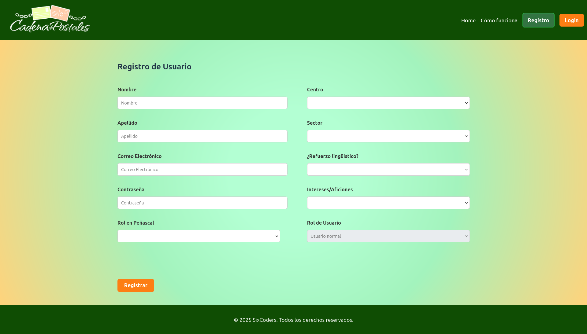
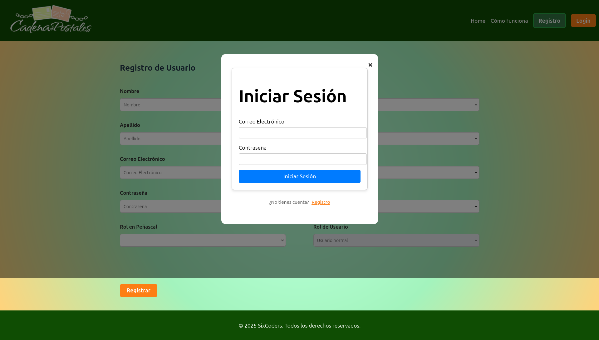

# 🌸 Cadena De Postales Frontend

#### Este es el repositorio del frontend para la aplicación **Postales**, desarrollada como parte del proyecto en SomosF5.

## 📌 Descripción del proyecto – Postales Frontend

Postales es una aplicación web interactiva que permite a los usuarios registrarse, iniciar sesión, crear, personalizar y compartir postales digitales.

El frontend, desarrollado con Vue.js y Vite, ofrece una experiencia de usuario moderna, fluida y adaptable a dispositivos móviles.

#### Este proyecto permite a los usuarios:

- Registrarse e iniciar sesión de forma segura
- Diseñar postales con mensajes personalizados
- Ver y gestionar sus postales creadas
- Compartir postales con otras personas

Postales Frontend se comunica con un backend que maneja autenticación, almacenamiento y lógica de negocio.

## 🚀 Tecnologías utilizadas

- **Vue.js**
- **JavaScript**
- **HTML5**
- **CSS**

## 📁 Estructura del proyecto

```plaintext
postales-front/
|── .history/
|── node_modules/
├── public/
├── src/
│   ├── assets/
│   ├── components/
│   ├── composables/
│   ├── layouts/
│   ├── router/
│   ├── stores/
│   ├── views/
│   ├── App.vue
│   └── main.js
├── .env
├── .gitignore
├── index.html
├── package-lock.json
├── package.json
├── README.md
└── vite.config.js
```


## pagina de Home


La página de inicio da la bienvenida a los usuarios con un mensaje emotivo y el logotipo del proyecto. Presenta el objetivo principal: mejorar el español mediante cartas manuscritas. Incluye una imagen de fondo tipo postal y un botón para conocer la dinámica.

## Register form


Permite a nuevos usuarios crear una cuenta ingresando su nombre, correo y contraseña. Los datos se validan y se envían al backend para acceder a la plataforma.

## login form


Permite a los usuarios acceder a su cuenta ingresando correo y contraseña. Verifica los datos con el backend y redirige al panel si el inicio es exitoso.

## 💻 Instalación y ejecución

1. Clona el repositorio:

```bash
git clone https://github.com/Postales-SomosF5/postales-front.git
cd postales-front
```
2. Instala las dependencias:
```bash
npm install
```
3. Ejecuta el proyecto:
```bash
npm run dev
```
4. Abre el navegador en http://localhost:5173/info

## ⚙️ Cómo funciona

- El usuario entra a la app y puede registrarse o iniciar sesión.
- Una vez autenticado, puede crear, ver y compartir postales personalizadas.
- Las postales se almacenan y recuperan desde un backend conectado.
- La navegación entre páginas se realiza con Vue Router.
- El diseño es responsive y se adapta a distintos dispositivos.

## ✨ Funcionalidades

Registro e inicio de sesión de usuarios
Creación y visualización de postales
Diseño responsive para móviles y escritorio

## 🔗 Backend

Este proyecto se conecta con este repositorio de backend:
👉 Postales Backend git https://github.com/Postales-SomosF5/postales-back.git

## 📌 Notas

- Este proyecto está conectado con un backend independiente que maneja autenticación y datos.
- Asegúrate de tener configurada la URL del backend correctamente en las variables de entorno.

## 🙌 Contribuciones

Las contribuciones son bienvenidas. Puedes hacer un fork del repositorio, crear una nueva rama, y enviar un pull request.
